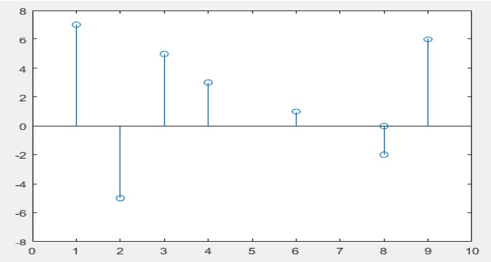

## Experiment No : 01

## Experiment Name :

## Presentation of Unit step, Unit impulse, Ramp, Discrete, Continuous and their arithmetic operation.

---

## Theory :

<div align='justify'>
A unit step signal, also known as a Heaviside step function, is a mathematical function that is commonly used in engineering and physics to represent a sudden change or "step" in a system. The function is denoted by u(t) and is defined as:

</div>

</br>

> u(t) = 0 for t < 0 </br>
> u(t) = 1 for t >= 0

<div align='justify'>

A unit impulse signal, also known as a Dirac delta function, is a mathematical function that is zero for all values of t except for t=0, where it has an infinitely short, infinitely tall "spike" of area 1.The function is denoted by δ(t) and is defined as:

</div>

> δ(t) = 0 for t ≠ 0 </br>
> ∫δ(t)dt = 1

<div align='justify'>

A ramp signal, also known as a ramp function, is a mathematical function that represents a linearly increasing or decreasing signal over time. The function is denoted by r(t) and is defined as:

</div>

> r(t) = 0 for t < 0 </br>
> r(t) = t for t >= 0 (ramp up) </br>
> r(t) = -t for t >= 0 (ramp down) </br>

</br>

<div align='justify'>

A continuous signal is a mathematical function that represents a physical signal that can take on any value within a certain range over a continuous interval of time or space.

</div>

<div align='justify'>

A discrete signal is a mathematical function that is sampled and quantized at regular intervals, and the value of the signal is only defined at those specific points in time or space.

</div>

## Required Material:

> Matlab

## Code : (Unit Step, Unit impulse, Ramp)

```matlab
1. clc;
2. clear all;
3. close all;
4. t=-10:0.001:10;
5.
6. step1= t>= 0;
7. step2= t==0;
8. step3= (t>=0).*t;
9.
10. subplot(3,1,1);
11. plot(t,step1);
12. xlabel('Time');
13. ylabel('Amplitude');
14. title('Unit step');
15. ylim([-0.5, 1.5]);
16. subplot(3,1,2);
17.
18. plot(t,step2);
19.
20. xlabel('Time');
21. ylabel('Amplitude');
22. title('Unit Impluse');
23. ylim([-0.5, 1.5]);
24. subplot(3,1,3);
25.
25. plot(t,step3);
26. xlabel('Time');
27. ylabel('Amplitude');
28. title('Unit ramp');
29. ylim([-1, 6]);

```

## Output:


**Fig.1.1** : Signal Output

## Code: (Discrete Signal)

```matlab
1. clc;
2. clear all;
3. close all;
4.
5. x=[1, 0, -5, 7, 5, -2, 6, 3];
6. y=[6 8 2 1 3 8 9 4];
7. stem(y,x);
8. xlim([0,10]);
9. ylim([-8, 8]);
```

## Output :



**Fig.1.2:** Discrete Signal

## Code: (Arithmetic operation of two different discrete signal)

```matlab
1. clc;
2. clear all;
3. close all;
4. t=-10:2:20;
5. n1=t>=0 &t<=10;
6. n2=t>=5 & t<=15;
7. subplot(4,1,1);
8.
9. stem(t,n1);
10. xlabel('Time');
11. ylabel('Amplitude');
12. title('1st Signal ');
13.
14.
15. subplot(4,1,2);
15. stem(t,n2);
16. xlabel('Time');
17. ylabel('Amplitude');
18. title('2nd Signal ');
19.
20. Step1 = n1+n2
22. subplot(4,1,3);
21. stem(t,step1);
22. xlabel('Time');
23. ylabel('Amplitude');
24. title('Addition');
25.
26. Step2 = n1-n2
29. subplot(4,1,4);
27. stem(t,step2);
28. xlabel('Time');
29. ylabel('Amplitude');
30. title('Subtraction');
```

## Output :


**Fig.1.3:** Discrete Signal operation Output

## Code: (Plotting two different continuous signals)

```matlab
1. clc;
2. clear all;
3. close all;
4. t=0:1:7;
5. u = [ones(1,1).*1 ones(1,2).*2 ones(1,1).*4 ones(1,1).*4 ones(1,2).*2 ones(1,1)];
6. subplot(2,1,1);
7. plot(t,u);
8. xlabel('Time');
9. ylabel('Amplitude');
10. title('Signal 1');
11. t=0:1:6;
16. u1 = [zeros(1,1) ones(1,5) zeros(1,1)];
17. subplot(2,1,2);
12. plot(t,u1);
13. xlabel('Time');
14. ylabel('Amplitude');
15. title('Signal 2');
```

## Output :


**Fig.1.4:** Continious Signal

## Conclusion:

<div align='justify'>

In this experiment, we have plotted different type of signal. The codes gave correct output graphs which were same as the theoretical explanation and given functions.

</div>
