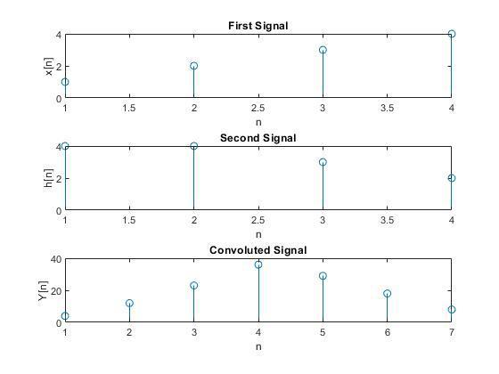

## Experiment Date : 30/04/23

## Experiment No : 02

## Experiment Name :

## Linear Convolution of Two Signals

---

## Objective :

The objective of this experiment is to know about Convolution of Two Signal.

## Theory :

<p align='justify'>
Linear convolution is an operation used in signal processing to combine two signals, typically represented as sequences of numbers, into a third signal. The linear convolution of two signals is defined as the sum of element-wise products of corresponding elements from the two input sequences.

> Mathematically, if we have two input sequences x[n] and h[n], where n represents the discrete time index, the linear convolution, denoted as y[n], is given by:
>
> $$
> y\left( n\right) =x\left( n\right) \cdot h\left( n\right) =\sum ^{\infty }_{k=-\infty }x\left( k\right) \cdot h\left( n-k\right)
> $$
>
> Or,
>
> $$
> y\left( n\right) =h\left( n\right) \cdot x\left( n\right) =\sum ^{\infty }_{k=-\infty }h\left( k\right) \cdot x\left( n-k\right)
> $$
>
> <div align='justify'>
> In this equation, the output sequence y[n] is obtained by summing the product of each element x(k) of the first sequence and the corresponding element h(n – k) of the second sequence, for all possible values of k.

</div>

<div align='justify'>

</br>

To compute the linear convolution in practice, we can use various methods such as:

1. Direct summation: Iterate over all possible values of k and compute the sum of (x(k) \* h(n – k)) for each n.
2. Circular convolution: Perform circular shifts on the input sequences, and then perform element-wise multiplication and summation.
3. Fast Fourier Transform (FFT): Convert the sequences into the frequency domain using FFT, perform element-wise multiplication, and then convert back to the time domain using inverse FFT.

The choice of method depends on the specific requirements and constraints of the application, as well as the size and properties of the input sequences. Each method has its advantages and disadvantages in terms of computational complexity and accuracy.

</div>
</p>

## Required Material:

> Matlab

## Code :

```matlab
1. x = [1, 2, 3, 4];
2. h = [4, 4, 3, 2];
3. L = length(x);
4. M = length(h);
5. N = L + M - 1;
6. cv = zeros(1,N);
7. x1 = [x, zeros(1,L)];
8. h1 = [h, zeros(1,M)];
9. for i = 1:N
10. for j = 1:M
11. if (i-j+1) > 0 && i-j+1 <=L
12. cv(i) = cv(i) + x1(j)*h1(i-j+1);
13. end
14. end
15. end
16. disp(cv)
17. subplot(3,1,1); stem(x); xlabel('n');
18. ylabel('x[n]'); title('First Signal');
19. subplot(3,1,2); stem(h); xlabel('n');
20. ylabel('h[n]'); title('Second Signal');
21. subplot(3,1,3); stem(cv); xlabel('n');
22. ylabel('Y[n]'); title('Convoluted Signal');

```

## Output:



**Fig.2.1** : Convolution of Two Signal

## Conclusion:

<div align='justify'>

In this experiment, Outcome of Convoluted signal as it is as Theory. So, we can say that the experiment was done correctly.

</div>
