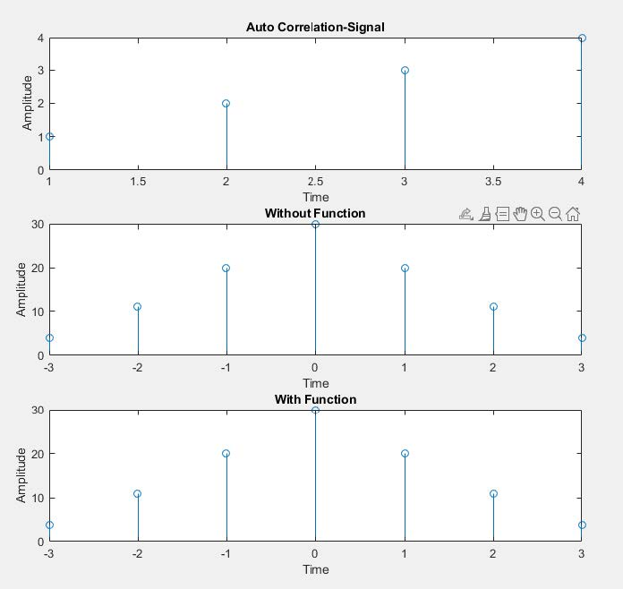
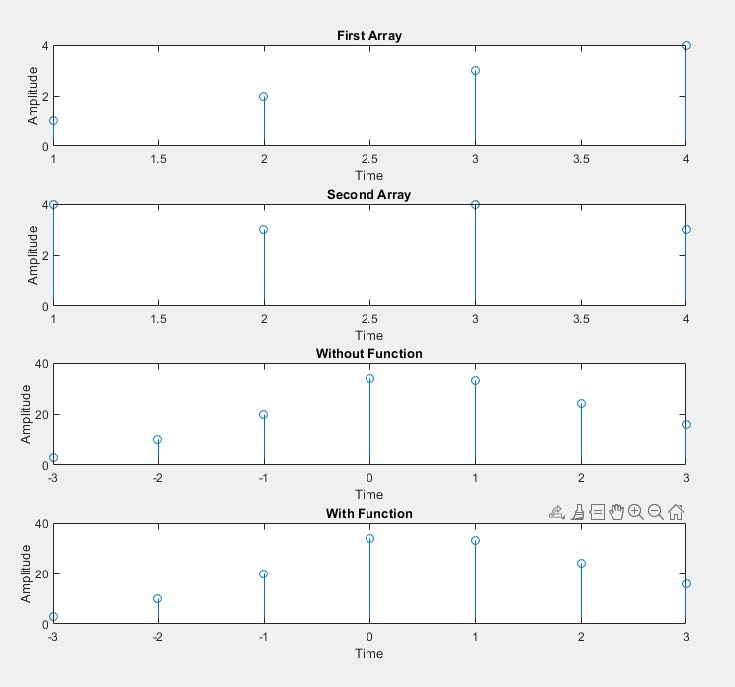

## Experiment Date : 07/05/23

## Experiment No : 03

## Experiment Name:

## Auto-Correlation and Cross-Correlation in MATLAB

---

## Objective :

The objective of this experiment is to know about Auto-Correlation and Cross-Correlation

## Theory :

<div align='justify'>
Autocorrelation is a mathematical operation that measures the similarity between a signal and a time-delayed version of itself. It provides information about the periodicity or repetitive patterns present in a signal. Autocorrelation is widely used in various applications such as audio processing, speech recognition, image processing, and communication systems.
</div>

<br>

> Mathematically, the autocorrelation function of a discrete-time signal x(n) is defined as:
>
> $$
> r_{xx}=\sum ^{\infty }_{n=-\infty }x\left( n\right) \cdot x\left( n-m\right)
> $$
>
> where Rxx(m) represents the autocorrelation value at lag m, x(n) is the input signal.

<br>

The autocorrelation function has several properties that are useful in analyzing signals:

<div align='justify'>

1. **Symmetry**: For real-valued signals, the autocorrelation function is symmetric, i.e., Rxx(m) = Rxx(-m). This property indicates that positive and negative lags yield the same autocorrelation value.

</div>

<div align='justify'>

2. **Peak value**: The autocorrelation function is maximized when the lag is zero (Rxx(0)). This value represents the energy or power of the signal.
</div>

<div align='justify'>

3. **Width of peaks**: The width of the autocorrelation peaks provides information about the signal's duration or the spacing between repetitive patterns. Narrow peaks indicate a highly periodic signal, while wider peaks suggest less periodicity.
</div>

<div align='justify'>

4. **Side lobes**: The autocorrelation function may exhibit side lobes or secondary peaks on either side of the main peak. These side lobes can provide insights into the presence of interfering signals or noise.
   </div>

      <br>
      <br>
   <div align='justify'>

Cross-correlation is a mathematical operation that measures the similarity between two signals as a function of the time lag between them. It is a useful tool for analyzing relationships between different signals, such as finding similarities, time delays, or synchronization between them. Cross-correlation is employed in various applications, including audio and speech processing, image processing, communications, and pattern recognition.

</div>

> Mathematically, the cross-correlation function is given by:
>
> $$
> r_{xy}=\sum ^{\infty }_{n=-\infty }x\left( n\right) \cdot y\left( n-m\right)
> $$
>
> where Rxy(m) represents the cross-correlation value at lag m, x(n) and y(n) are the two input signals, and the summation is performed over the appropriate range of n.

<br>

Some properties of the cross-correlation function include:

1. **Symmetry**: For real-valued signals, the cross-correlation function is symmetric, i.e., Rxy(m) = Ryx(-m). This property implies that the cross-correlation is unaffected by swapping the order of the signals.

<div align='justify'>

2. **Peak value**: The maximum value of the cross-correlation function (Rxy(m)) indicates the best alignment or similarity between the two signals. It represents the strength of the correlation at the corresponding time lag.

</div>

<div align='justify'>

3. **Lag interpretation**: The lag at which the cross-correlation function achieves its peak value indicates the time delay between the signals. Positive lags indicate that y(n) is delayed with respect to x(n), while negative lags indicate the opposite.
</div>

<div align='justify'>

4. **Cross-correlation coefficients**: Normalized cross-correlation coefficients can be obtained by dividing the cross-correlation function by the product of the standard deviations of the two signals. This normalization ranges from -1 to 1, where values closer to 1 indicate strong positive correlation, values closer to -1 indicate strong negative correlation, and values near 0 suggest no significant correlation.

</div>

## Required Material:

> Matlab

## Code: (Auto-correlation)

```matlab
clc
clear all;
close all;
x=input('Enter the Array:');
n1=input('Enter the time sample range:');
h=fliplr(x);
n2=-fliplr(n1);
z=[];
for i=1:length(x)
	g=h.*x(i);
	z=[z;g];
end
[r c]=size(z);
k=r+c;
t=2;
y=[];
cd=0;
while(t<=k)
  for i=1:r
	for j=1:c
	  if((i+j)==t)
		cd=cd+z(i,j);
	  end
	end
  end
  t=t+1;
  y=[y cd];
  cd=0;
end

subplot(3,1,1);
stem(x);
title('Auto Correlation-Signal');
xlabel('Time');
ylabel('Amplitude');

subplot(3,1,2);
nl=min(n1)+min(n2);
nh=max(n1)+max(n2);
t=nl:1:nh;
stem(t,y);
title('Without Function');
xlabel('Time');
ylabel('Amplitude');

subplot(3,1,3);
z=xcorr(x,x);
stem(t,z);
title('With Function');
xlabel('Time');
ylabel('Amplitude');

```

## Input:

Enter the Array: [1 2 3 4]
Enter the time sample range: [0 3]

## Output:



**Fig.3.1** : Auto Correlation Signal

## Code: (Cross-correlation)

```matlab
clc
clear all;
close all;
x=input('Enter the first Array:');
n1=input('Enter the time sample range:');
h=input('Enter the second Array');
n2=input('Enter the time sample range:');
n2=-fliplr(n2);
z=[];
w=fliplr(h);
for i=1:length(x)
    g=w.*x(i);
    z=[z;g];
end
[r c]=size(z);
k=r+c;
t=2;
y=[];
cd=0;
while(t<=k)
    for i=1:r
        for j=1:c
            if((i+j)==t)
                cd=cd+z(i,j);
            end
        end
    end
    t=t+1;
    y=[y cd];
    cd=0;
end

subplot(4,1,1);
stem(x);
title('First Array');
xlabel('Time');
ylabel('Amplitude');

subplot(4,1,2);
stem(h);
title('Second Array');
xlabel('Time');
ylabel('Amplitude');

subplot(4,1,3);
nl=min(n1)+min(n2);
nh=max(n1)+max(n2);
t=nl:1:nh;
stem(t,y);
title('Without Function');
xlabel('Time');
ylabel('Amplitude');


subplot(4,1,4);
p=xcorr(x,h);
stem(t,p);
title('With Function');
xlabel('Time');
ylabel('Amplitude');
```

## Input:

Enter the first Array:[1 2 3 4]
Enter the time sample range:[0 3]
Enter the second Array[4 3 4 3]
Enter the time sample range:[0 3]

## Output :



**Fig.1.2:** Cross-Correlation Signal

## Conclusion:

<div align='justify'>

In this experiment, Outcome of Correlation signal as it is as Theory. So, we can say that the experiment was done correctly.

</div>
