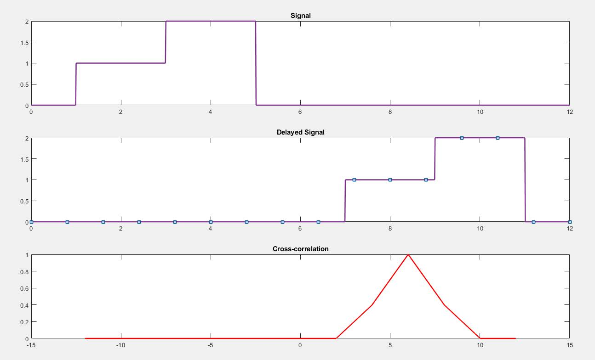
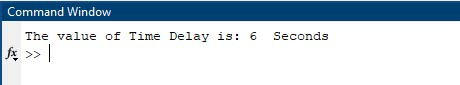

## Experiment No : 04

## Experiment Date : 14/05/23

## Experiment Name :

## Time Delay Detection of Two Signal By Cross-Correlation.

---

## Objective :

The objective of this experiment is to determine the Delay of two Signal using Cross-Correlation.

## Theory :

<p align='justify'>
Correlation is an operation used in many applications in digital signal processing. It is a measure of the degree to which two sequences are similar.Depending on whether the signals considered for correlation are same or different, we have two kinds of correlation: (i) Auto-Correlation, (ii) Cross-Correlation.
</p>
<p align='justify'>
In signal processing, cross-correlation is a measure of similarity of two signals relative to one another. This is very useful to determine the delay between two signals. Delay between two signals can be found out by determining the time instant during which both of the signals match with each other the best.
</p>
<p align='justify'>
The generalized cross correlation (GCC) is regarded as the most popular approach for estimating
the time difference of arrival (TDOA) between the signals received at two sensors. Time delay
estimates are obtained by maximizing the GCC output, where the direct-path delay is usually
observed as a prominent peak.
</p>

<br>

## Required Material:

> Matlab

</br>
## Code: (Delay Detection)

```matlab
clc;
clear all;

t=0:0.01:12;

y1= t>=1 & t<=5;
y2= t>=3 & t<=5;
s1=y1+y2;

x1= t>=7 & t<=11;
x2= t>=9 & t<=11;
s2=x1+x2;

[c,lag]=xcorr(s2,s1);
c1=c/max(abs(c(:)));

subplot(3,1,1)
plot(t,s1);
title('Signal');

subplot(3,1,2)
plot(t,s2);
title('Delayed Signal');

subplot(3,1,3)
plot(lag*0.01,c1);
title('Cross-correlation');

maxY = max(c1);
indexesOfMax = find(c1 == maxY);
p = lag(indexesOfMax);
q=p*0.01;

display_text = ['The value of Time Delay is: ', num2str(q),'Seconds'];
disp(display_text);

```

## Output:(Figure)



**Fig.4.1** : Output Signal

## Output:(Display)



**Fig.4.2** : Output Result

</br>
</br>

## Conclusion:

<div align='justify'>

In this experiment, Outcome of Time Delay of two signal as it is as Theory. So, we can say that the experiment was done correctly.

</div>
