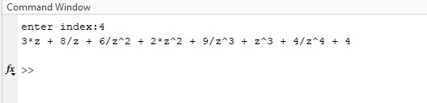

## Experiment No : 05

## Experiment Name :

## Z-transform of Causal, Anti-Causal & Non-Causal Signal

---

## Objective :

The objective of this experiment is to determine the Z transform of Causal, Anti-Causal & Non-Causal Signal

## Theory :

<p align='justify'>
The Z-transform is a mathematical technique commonly used in the analysis and design of discrete-time systems in signal processing and control theory. It is analogous to the Laplace transform used for continuous-time systems, but it's applied to discrete-time signals and systems.In simpler terms, the Z-transform takes a discrete-time signal and transforms it into a function of a complex variable z.

> If x(n) is a discrete time signal, then Z-transform is given by,
>
> $$
> Z\left[ x(n)\right] =X\left( Z\right)  =\sum ^{\infty }_{n=-\infty }x\left( n\right) z^{-n}
> $$
>
> where:
> X(z) is the Z-transform of the signal x[n],
> z is a complex variable,
> n is the discrete time index.

<p align='justify'>
A Causal signal is said to be causal if its amplitude is zero for negative time. In other words, a causal signal does not exist for negative time.i.e. x(n) = 0 for n < 0.
</p>

<p align='justify'>
An anti-causal signal is a continuous-time signal that is said to be anti-causal if its amplitude is zero for positive time, i.e. x(n) = 0 for n > 0. This means that an anti-causal signal does not exist for positive time. An example of an anti-causal signal is the time-reversed unit step signal u(-t).
</p>

<p align='justify'>
A non-causal signal is a signal that exists for both positive and negative time values. A signal which is neither causal nor anticausal is called a non-causal signal. Examples of non-causal signals include sine and cosine signals. 
</p>

</p>
<br>

## Required Material:

> Matlab

## Code: (Causal Signal)

```matlab
clc;
clear all;
close all;

x=[1 2 3 4 8 6 9 4];
l=length(x);


a=0;

z=sym('z');
for i=0:l-1
    a=a+x(i+1).*z^(-i);
end;

disp(a);

```

## Output:


**Fig.5.1** : Z transform of Causal Signal

## Code: (Anti-Causal Signal)

```matlab
clc;
clear all;
close all;
x=[1 2 3 4 8 6 9 4];
l=length(x);

a=0;

z=sym('z');
for i=0:l-1
    a=a+x(i+1).*z^(i);
end;


disp(a);

coeffs = sym2poly(a);
coeff=flip(coeffs);
disp(coeff);

```

## Output:


**Fig.5.2** : z Transform of Anti-Causal Signal and their Coefficient

## Code: (Non-Causal Signal)

```matlab
clc;
clear all;
close all;

index=input('enter index:');

x=[1 2 3 4 8 6 9 4];

l=length(x);

a=0;

z=sym('z');

for i=index:-1:1
    a=a+x(i)*z^(abs(i-(index)));
end;

for j=index+1:l
    a=a+x(j)*z^(-(j-index));
end;

disp(a);

```

## Input:


## Output:



**Fig.5.3** : z Transform of Non-Causal Signal and their Coefficient

</br>
</br>

## Conclusion:

<p align='justify'>

In this experiment, Outcome of z-transform of causal, anti-causal and non-causal signals as it is as Theory. So, we can say that the experiment was done correctly.

</p>
