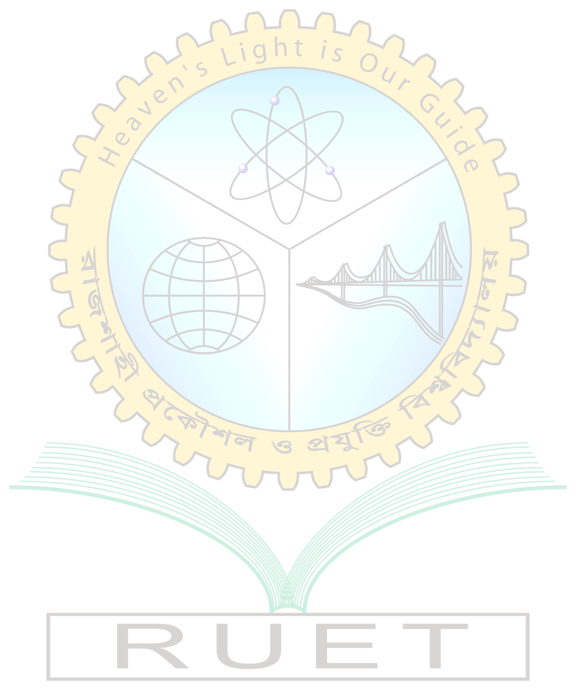

## Lab Reports

### Course name: Digital Signal Processing Sessional

### Course code: ECE 4124

 

| Submitted by:                                                                                                       | Submitted to:                                                                                         |
| ------------------------------------------------------------------------------------------------------------------- | ----------------------------------------------------------------------------------------------------- |
| **Hasan Al Muazzaz** Roll: **1810038**  Dept. of ECE Rajshahi University of Engineering and Technology  | **Hafsa Binte Kibria** Lecturer, Dept. of ECE Rajshahi University of Engineering and Technology |

 

### Table of Contents:

| Exp. No. |                                                  Title                                                  |                             Link                             |
| :------: | :-----------------------------------------------------------------------------------------------------: | :----------------------------------------------------------: |
|  **01**  | **Presentation of Unit step, Unit impulse, Ramp, Discrete, Continuous and their arithmetic operation.** | [Exp 01](https://github.com/Muazzaz/test2/tree/master/Lab_1) |
|  **02**  |                                  **Linear Convolution of Two Signals**                                  | [Exp 02](https://github.com/Muazzaz/test2/tree/master/Lab_2) |
|  **03**  |                          **Auto-Correlation and Cross-Correlation in MATLAB**                           | [Exp 03](https://github.com/Muazzaz/test2/tree/master/Lab_3) |
|  **04**  |                 **Time Delay Detection of Two Signal By Cross-Correlation.Correlation**                 | [Exp 04](https://github.com/Muazzaz/test2/tree/master/Lab_4) |
|  **05**  |                       **Z-transform of Causal, Anti-Causal & Non-Causal Signal**                        | [Exp 05](https://github.com/Muazzaz/test2/tree/master/Lab_5) |
